# 📊 Diagramas Complementares – Fluxo de Laudo e Visualização

**OmniLaudo AI** – Visualizações do Fluxo de Trabalho

---

## 1. Fluxo Completo: Do Exame ao Laudo Finalizado

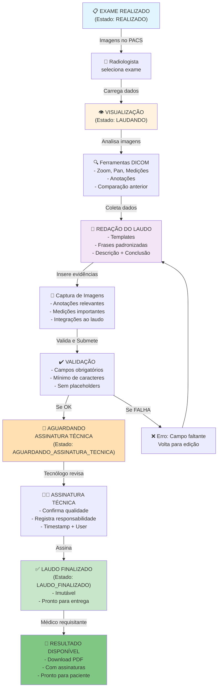

---

## 2. Anatomy – Tela de Laudagem (Componentes)

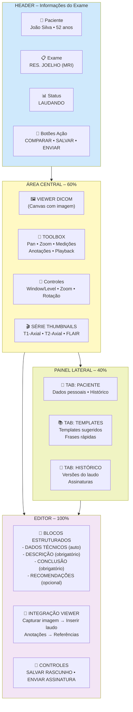

---

## 3. Fluxo de Estados – Máquina de Estados

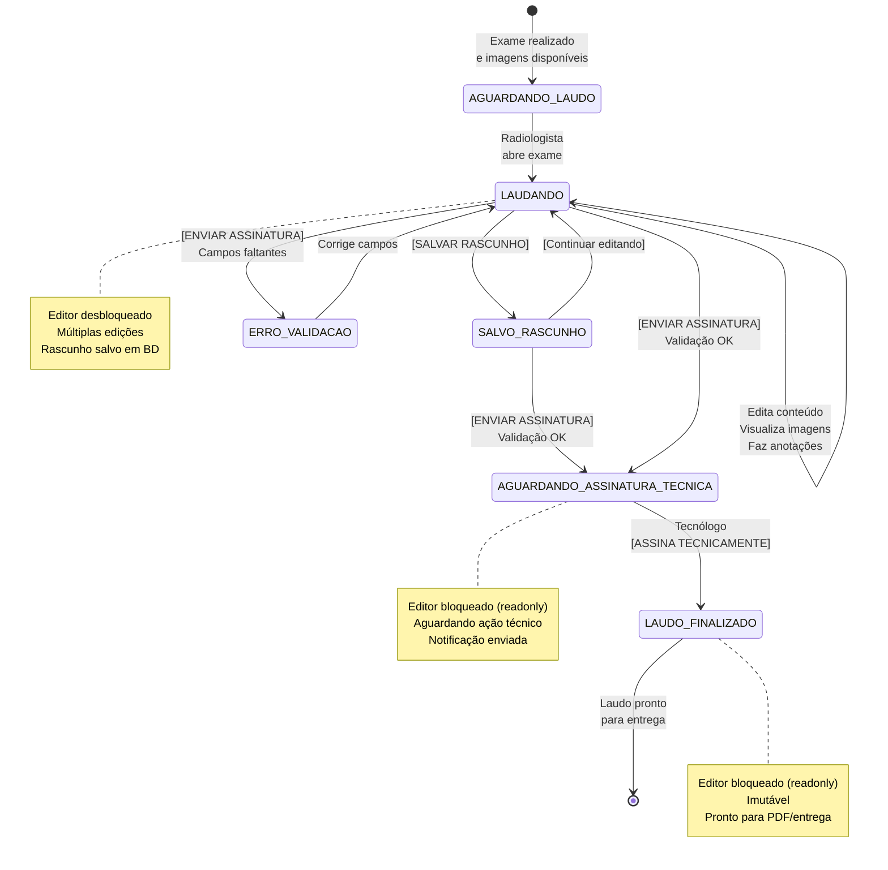

---

## 4. Viewer DICOM – Modo Side-by-Side

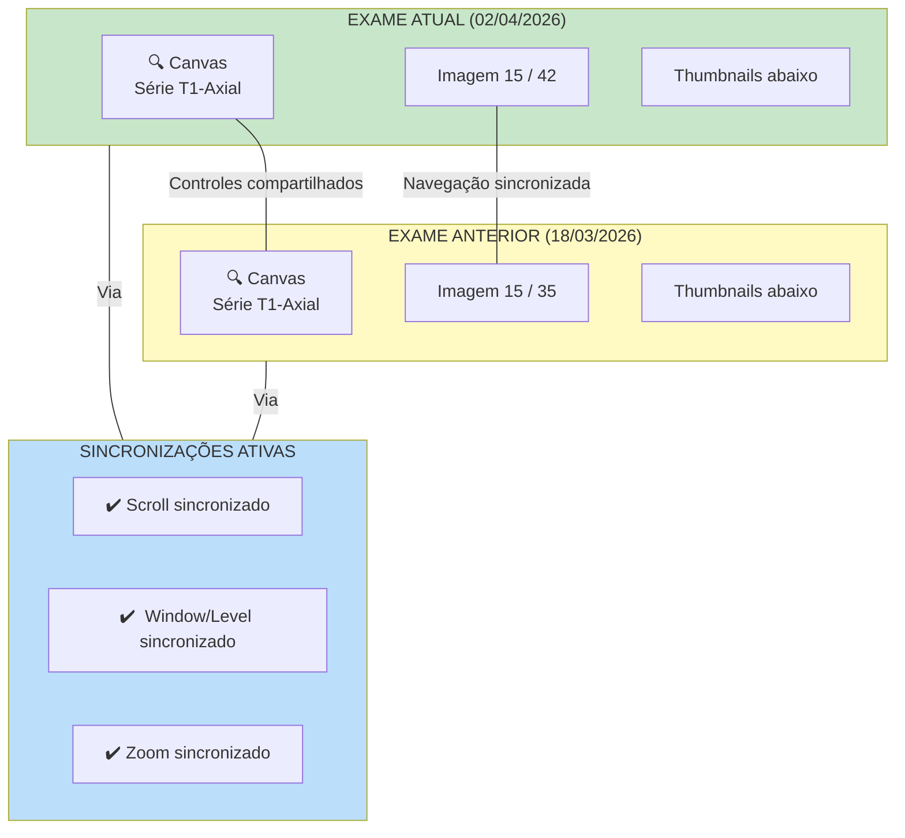

---

## 5. Ciclo de Edição – Radiologista

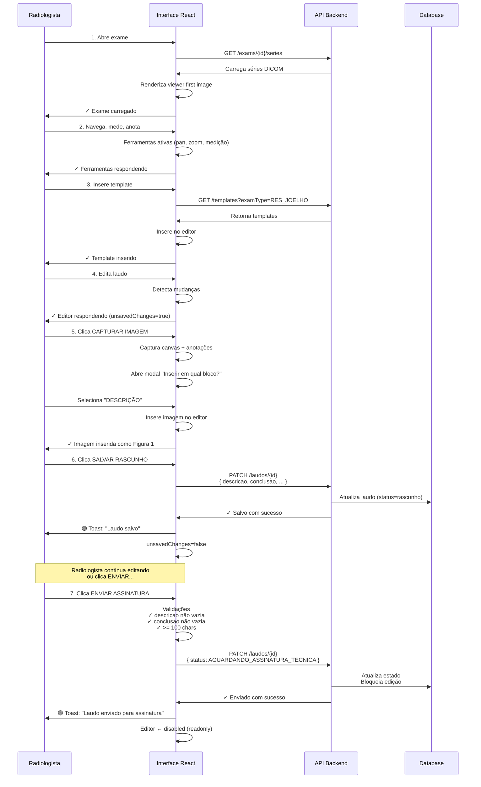

---

## 6. Ciclo de Assinatura – Tecnólogo

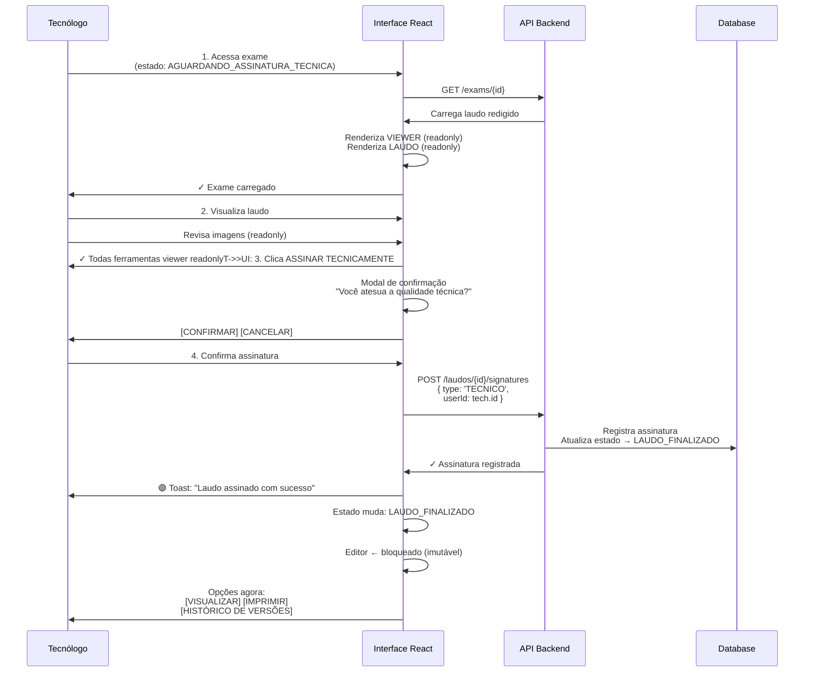

---

## 7. Comparação – Fluxo de Interação

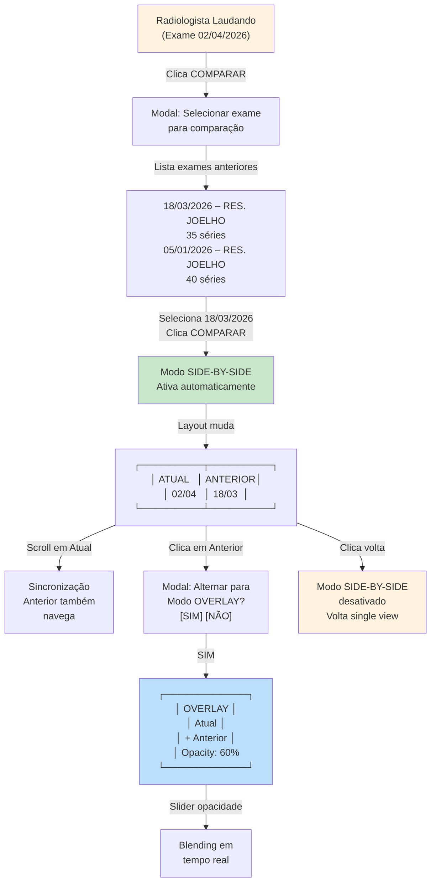

---

## 8. Arquitetura de Componentes React

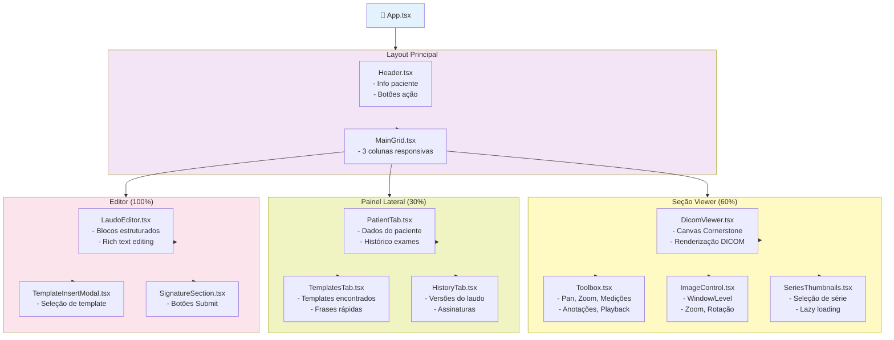

---

## 9. Redux Store – State Structure

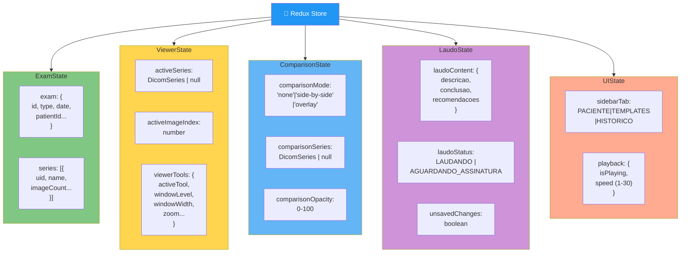

---

## 10. Fluxo de Captura Imagem → Inserir no Laudo

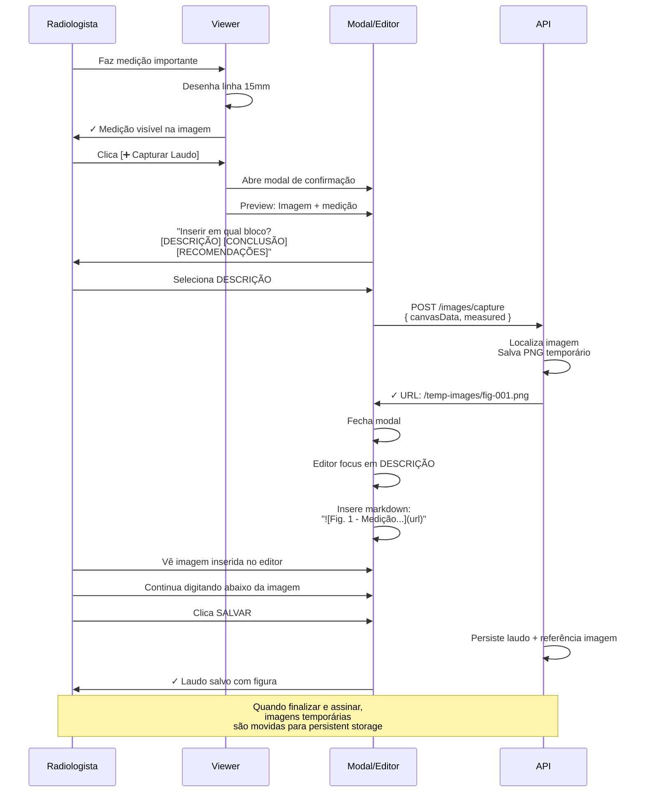

---

## 11. Matriz de Permissões – Por Perfil

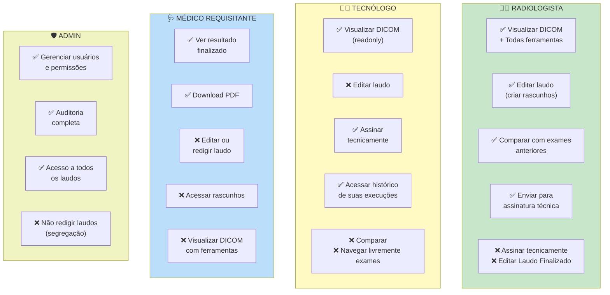

---

## 12. Performance – Estratégia de Carregamento

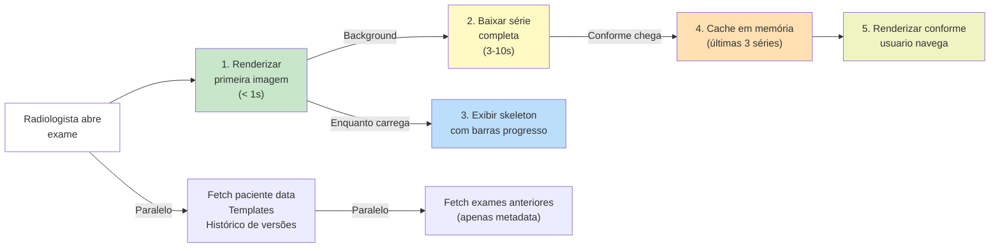

---

## 13. Tratamento de Erros – Fluxo

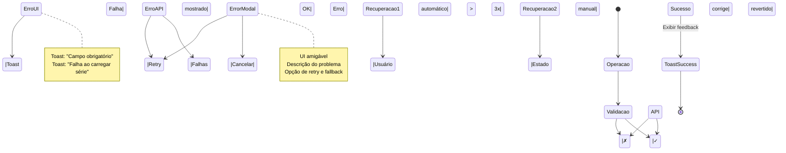

---

## 14. Timeline – Roadmap de Desenvolvimento

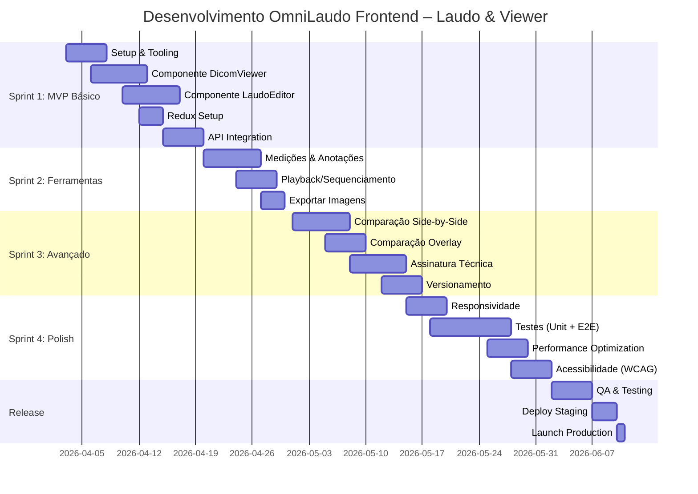

---

## 15. Checklist – Antes de Iniciar Desenvolvimento

### Fase Preparatória

```
□ Design System / UI Kit definido
  - Cores, tipografia, componentes base
  - Tokens (spacings, radius, shadows)

□ Prototipo em Figma/Adobe XD
  - Todos os estados da UI
  - Interações mouse/teclado
  - Responsive (desktop, tablet)

□ Ambiente de Desenvolvimento
  - Node.js + npm/yarn
  - TypeScript config
  - ESLint + Prettier
  - Jest + React Testing Library

□ Backend APIs Documentadas
  - Endpoints para exames, séries, laudos
  - Autenticação JWT
  - Tratamento de erros

□ Integração DICOM
  - Cornerstone.js versionado
  - Orthanc API disponível
  - CORS configurado

□ Performance Baseline
  - Benchmark: carregamento série < 3s
  - Memory profiling Cornerstone
  - Network throttling tests

□ Segurança
  - CSP headers configurados
  - XSS prevention
  - Input validation

□ Observabilidade
  - Logger setup (Pino/loglevel)
  - Error tracking (Sentry)
  - Analytics events
```

---

## 🎯 Conclusão

Estes diagramas complementam a especificação textual, fornecendo:

✅ **Visualização clara** dos fluxos de trabalho  
✅ **Sequência de ações** e interações  
✅ **Arquitetura de componentes** React  
✅ **Estrutura de estado** global  
✅ **Permissões e segurança** por perfil  
✅ **Timeline realista** de desenvolvimento  

Use este documento como referência durante:
- Prototipagem em Figma
- Code review com time
- Testing e QA
- Documentação de API
