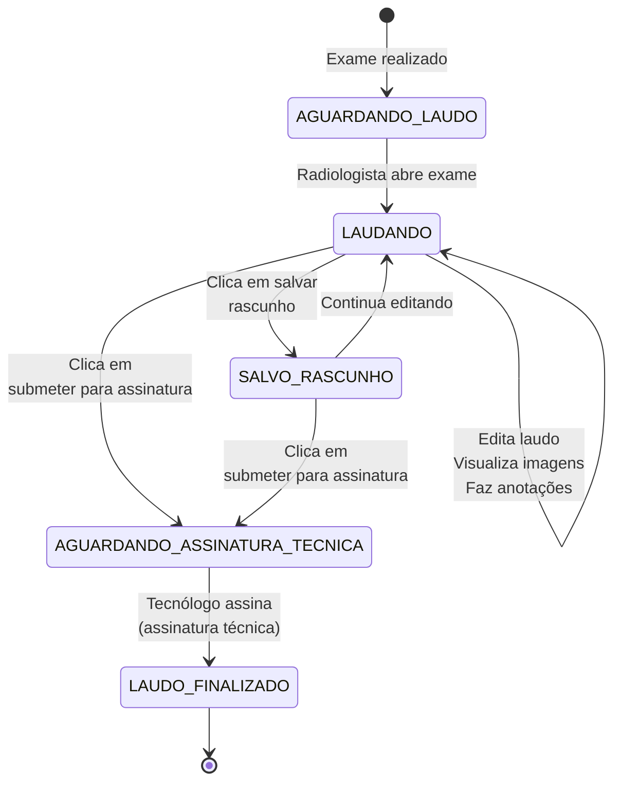
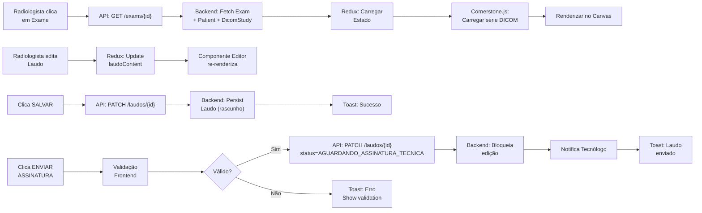

# 📋 Modelo de Fluxo – Laudo e Visualização de Imagens

**OmniLaudo AI** – Especificação de UX/UI para Prototipagem em React

---

## 1. Visão Geral

Este documento detalha o fluxo de trabalho do radiologista desde a seleção de um exame até a finalização do laudo, com ênfase integrada na visualização de imagens DICOM. A objetivo é fornecer uma especificação clara e actionable para o desenvolvimento do protótipo frontend em React.

### Contexto
- **Estado inicial do exame:** `REALIZADO` (imagens já disponíveis no PACS/Orthanc)
- **Radiologista inicia:** seleção de exame com estado `AGUARDANDO_LAUDO`
- **Objetivo final:** Laudo assinado com estado `LAUDO_FINALIZADO`

---

## 2. Fluxo Geral - Diagrama de Estados



---

## 3. Layout Principal – Tela de Laudagem

### 3.1 Estrutura de Grades (Grid)

A tela é dividida em **3 seções principais** (em proporção responsiva):

```
┌─────────────────────────────────────────────────────────────────┐
│  HEADER – Informações do Exame e Botões de Ação                 │
├─────────────────────────────────────────────────────────────────┤
│  │           VIEWER DICOM (60-70%)     │  PAINEL LATERAL (30-40%) │
│  │                                     │                          │
│  │   - Visualizador principal          │  - Dados do paciente     │
│  │   - Ferramentas de imagem           │  - Info. do exame        │
│  │   - Imagens sincronizadas           │  - Thumbnails séries    │
│  │                                     │  - Templates/Frases      │
│  ├─────────────────────────────────────┤  - Histórico de versões  │
│  │  BARRA DE SÉRIES (thumbnails)       │                          │
│  └─────────────────────────────────────┴──────────────────────────┘
├─────────────────────────────────────────────────────────────────┤
│  EDITOR DE LAUDO (100%)                                          │
│  - Editor de texto com templates                                 │
│  - Frases padronizadas inline                                    │
│  - Versionamento e histórico                                     │
└─────────────────────────────────────────────────────────────────┘
```

---

## 4. Seção 1: HEADER – Informações e Ações

### 4.1 Componentes do Header

```
┌──────────────────────────────────────────────────────────────────┐
│ [← VOLTAR]  │ NOME PACIENTE • IDADE • ID   │ STATUS: LAUDANDO    │
│             │ Tipo Exame (ex: RES. DE JOELHO) • Modalidade: MRI  │
│             │ Data Exame: 02/04/2026 09:30 • Estudos: 3 séries   │
├──────────────────────────────────────────────────────────────────┤
│ [COMPARAR] [HISTÓRICO] [IMPRIMIR]  ...  [SALVAR RASCUNHO] [ENVIAR ASSINATURA] │
└──────────────────────────────────────────────────────────────────┘
```

#### Botões e Ações

| Botão | Função | Estado | Validação |
|-------|--------|--------|-----------|
| **← VOLTAR** | Volta à lista de exames | Sempre ativo | Se houver rascunho, avisar antes de sair |
| **COMPARAR** | Abre modal com exames anteriores | Ativo se houver exames anteriores | Apenas paciente e tipo exame iguais |
| **HISTÓRICO** | Timeline de versões do laudo | Ativo se > 1 versão | Mostra versões antigas e autores |
| **IMPRIMIR** | Gera PDF para impressão | Apenas se laudo finalizado | Incluir assinaturas visuais |
| **SALVAR RASCUNHO** | Persiste o laudo em edição | Sempre ativo | Toast de confirmação |
| **ENVIAR ASSINATURA** | Submete laudo para assinatura técnica | Ativo se há conteúdo | Valida campos obrigatórios |

---

## 5. Seção 2: VIEWER DICOM – Visualizador de Imagens

### 5.1 Componentes do Viewer

```
┌─────────────────────────────────────────────────────────────────┐
│  [TOOLBOX]                         [CONTROLES]  [INFO]           │
├─────────────────────────────────────────────────────────────────┤
│                                                                  │
│                      CANVAS PRINCIPAL                            │
│                     (Imagem DICOM renderizada)                   │
│                                                                  │
│                      [Window Level: 60]                          │
│                      [Window Width: 512]                         │
│                                                                  │
│  Série 1 / 42  [< >]  Play ⏵                                    │
│  [████████████░░░░]  Imagem 12 de 42                            │
└─────────────────────────────────────────────────────────────────┘
```

### 5.2 Toolbox – Ferramentas de Imagem

#### 5.2.1 Ferramentas Básicas (sempre visíveis)

```
┌─────────────────────┐
│ FERRAMENTAS         │
├─────────────────────┤
│ 🖱️  Mão (Pan)       │  Livre movimento
│ 🔍  Zoom            │  Ampliar/Reduzir
│ ↻    Rotação         │  0°, 90°, 180°, 270°
│ ↔    Flip H          │  Horizontal
│ ↕    Flip V          │  Vertical
├─────────────────────┤
│ 📏  Medição          │  Comprimento, Ângulo, Área
│ 📝  Anotação         │  Texto, Seta, Forma
│ 🎯  ROI              │  Região de interesse com stats
├─────────────────────┤
│ 🔄  Janela Predefinida │  "Osso", "Pulmão", "Soft"
│ ⚙️   Manual W/L       │  Window width & level
├─────────────────────┤
│ 🎞️  Playback         │  Sequenciamento automático
│ ⚖️  Comparar         │  Lado a lado / Overlay
├─────────────────────┤
│ 💾  Exportar         │  PNG, JPG, DICOM
│ ➕  Capturar Laudo   │  Insere imagem/anotação
└─────────────────────┘
```

#### 5.2.2 Comportamento de Ferramentas Ativas

- **Ferramenta selecionada:** Destacada em cor primária
- **Atalhos de teclado:** Exibir tooltip ao passar mouse
  - `M` = Mão (Pan)
  - `Z` = Zoom
  - `R` = Rotação
  - `A` = Anotação
  - `SPACE` = Playback on/off
  
---

### 5.3 Visualização Padrão – Single Image (Série Única)

**Estado Padrão:**
- Uma série selecionada
- Primeira imagem exibida
- Canvas com fundo cinza escuro (DICOM standard)
- Info overlay no canto inferior esquerdo

```
┌──────────────────────────────────────────────────────┐
│  Tipo: MRI / Série 1 – T1 (32 imagens)              │
│  Tamanho: 512x512 • Instance UID: [truncated...]    │
│  Posição: 1/32                                      │
└──────────────────────────────────────────────────────┘
```

---

### 5.4 Visualização Avançada – Comparação com Exame Anterior

#### 5.4.1 Modo Side-by-Side

```
┌──────────────────────────────────┬──────────────────────────────┐
│   EXAME ATUAL (02/04/2026)       │   EXAME ANTERIOR (18/03/2026)│
│                                  │                              │
│   [Imagem 12 / 42]               │   [Imagem 12 / 35]           │
│                                  │                              │
│   Series: T1 – Axial             │   Series: T1 – Axial         │
│                                  │                              │
│   W: 512 / L: 60                 │   W: 512 / L: 60             │
│                                  │                              │
└──────────────────────────────────┴──────────────────────────────┘
```

**Sincronização:** 
- Scroll sincronizado entre imagens
- Mesma ferramenta ativa em ambas
- Window Level sincronizado (opcional, via checkbox)

#### 5.4.2 Modo Overlay

```
┌──────────────────────────────────┐
│   EXAME ATUAL (02/04/2026)       │
│   [Imagem 12 / 42]               │
│                                  │
│   Opacidade: [████░░░░░░] 60%    │
│                                  │
│   [⊕ Exame Anterior via overlay] ← Checkbox
│   (02/04/2026)                   │
│                                  │
│   W: 512 / L: 60                 │
│                                  │
└──────────────────────────────────┘
```

**Controle de Opacidade:**
- Slider 0-100% para blending
- Ajuste em tempo real

---

### 5.5 Playback – Sequenciamento Automático

**Ativação:** Clique em ⏵ ou tecla ESPAÇO

```
┌───────────────────────────────────────────┐
│ Playback em execução...                    │
├───────────────────────────────────────────┤
│ [⏸ Pausar]  [⏹ Parar]                    │
├───────────────────────────────────────────┤
│ Velocidade: [◄═══●═════►]  10 fps          │
│             (1-30 fps)                    │
├───────────────────────────────────────────┤
│ Modo: ◉ Loop Contínuo  ○ Ciclo Único      │
│       ◉ Forward        ○ Backward         │
├───────────────────────────────────────────┤
│ Progresso: [████████░░░░░░░░░░] 42% (17/42) │
└───────────────────────────────────────────┘
```

---

### 5.6 Barra de Séries – Thumbnails

Localizada abaixo do viewer principal com scrolling horizontal.

```
┌───────────────────────────────────────────────────────────────┐
│ SÉRIES DO ESTUDO:                                             │
├───────────────────────────────────────────────────────────────┤
│ [T1-Axial] [T2-Axial] [FLAIR-Axial] [T1-Sagital] [DTI]       │
│ 42 img.     38 img.    35 img.      40 img.     50 img.      │
│    1           2          3            4         5           │
│  Ativa◄─────                                                  │
│                                                                │
│ [< Scroll >]                                                   │
└───────────────────────────────────────────────────────────────┘
```

**Interações:**
- Clique: seleciona série e exibe primeira imagem
- Duplo clique: fullscreen
- Scroll horizontal: navega entre séries

---

## 6. Seção 3: PAINEL LATERAL – Contexto e Ações

### 6.1 Abas do Painel

```
┌─────────────────┐
│ [PACIENTE] [TEMPLATES] [HISTÓRICO]
├─────────────────┴─────────────────────────┐
│                                           │
│  ABA: PACIENTE                            │
│  ─────────────────────────────────────── │
│  Nome: João da Silva                     │
│  Idade: 52 años • Sexo: M                │
│  CPF: 123.456.789-00                     │
│  Data Nasc: 15/12/1971                   │
│                                           │
│  Alergias: PENICILINA ⚠️                 │
│  Diagnóstico Clínico: Dor no joelho     │
│                                           │
│  ─────────────────────────────────────── │
│  HISTÓRICO DE EXAMES (este paciente)    │
│                                           │
│  📄 02/04/2026 – RES. JOELHO (ATUAL)    │
│  📄 18/03/2026 – RES. JOELHO            │
│  📄 05/01/2026 – RX TORAX               │
│                                           │
│  [Ver Comparação ↗]                     │
│                                           │
└─────────────────────────────────────────┘
```

### 6.2 Aba TEMPLATES

```
┌─────────────────┐
│ [PACIENTE] [TEMPLATES] [HISTÓRICO]
├─────────────────┴─────────────────────────┐
│                                           │
│  TEMPLATES DISPONÍVEIS                    │
│  (Filtrado por: RES. DE JOELHO)          │
│                                           │
│  🔍 [Buscar templates...]                │
│                                           │
│  ✓ Template Padrão RES. Joelho           │
│    └ "Estruturas ósseas, cartilaginosas, │
│       ligamentares..."                    │
│    [+] Inserir                           │
│                                           │
│  ✓ Template – Joelho Pós-op              │
│    └ "Verificar enxertos, parafusos..."   │
│    [+] Inserir                           │
│                                           │
│  ✓ Template – Artrite                    │
│    └ "Espaço articular reduzido..."      │
│    [+] Inserir                           │
│                                           │
│  ─────────────────────────────────────── │
│  FRASES RÁPIDAS (Atalhos)                │
│                                           │
│  "Sem alterações significativas"         │
│    [Ctrl+1]                              │
│                                           │
│  "Processo inflamatório em"              │
│    [Ctrl+2]                              │
│                                           │
│  "Compatível com"                        │
│    [Ctrl+3]                              │
│                                           │
└─────────────────────────────────────────┘
```

### 6.3 Aba HISTÓRICO (Versões)

```
┌─────────────────┐
│ [PACIENTE] [TEMPLATES] [HISTÓRICO]
├─────────────────┴─────────────────────────┐
│                                           │
│  HISTÓRICO DE VERSÕES                     │
│                                           │
│  ✓ VERSÃO ATUAL (Rascunho)               │
│    Autor: Dr. Silva                      │
│    Criado: 02/04/2026 14:32              │
│    Status: Em edição                     │
│    [Visualizar]                          │
│                                           │
│  ─────────────────────────────────────── │
│                                           │
│  VERSÃO 1 (Finalizada)                   │
│    Autor: Dr. Silva                      │
│    Criado: 01/04/2026 10:15              │
│    Assinado Técnico: Tech. João (10:45)  │
│    Assinado Médico: Dr. Silva (10:50)    │
│    Status: Finalizado                    │
│    [Visualizar] [Reimprimir]             │
│                                           │
│  ─────────────────────────────────────── │
│                                           │
│  VERSÃO 2 (Revisão)                      │
│    Autor: Dr. Silva                      │
│    Criado: 01/04/2026 15:00              │
│    Status: Rascunho antigo                │
│    [Visualizar] [Descartar]              │
│                                           │
└─────────────────────────────────────────┘
```

---

## 7. Seção 4: EDITOR DE LAUDO

### 7.1 Layout do Editor

```
┌─────────────────────────────────────────────────────────────┐
│ EDITOR – Laudo Descrição                                    │
├─────────────────────────────────────────────────────────────┤
│                                                              │
│  |+ TEMPLATE  [Buscar...]  [NEGRITO] [ITÁLICO] [LISTA]  |   │
│  ====================================================      │
│                                                              │
│  DADOS TÉCNICOS:                                            │
│  Modalidade: Ressonância Magnética (MRI)                   │
│  Equipamento: Siemens MAGNETOM – 3.0T                      │
│  Sequências: T1, T2, FLAIR, DTI                            │
│  Data/Hora Exame: 02/04/2026 09:30                         │
│  Realizado por: Tech. João da Silva                        │
│                                                              │
│  DESCRIÇÃO:                                                 │
│  [| Cursor aqui...]                                        │
│                                                              │
│  As estruturas ósseas do joelho apresentam densidade        │
│  e alinhamento normal. Os espaços articulares mostram       │
│  amplitude preservada...                                    │
│                                                              │
│  [Capturar imagem] ← Insere imagem/anotação do viewer     │
│                                                              │
│  ─────────────────────────────────────────────────────────  │
│  CONCLUSÃO:                                                  │
│  [| Cursor aqui...]                                        │
│                                                              │
│  1. Sem alterações significativas nos meniscos             │
│  2. Ligamentos cruzados íntegros                           │
│  3. Articulações tibiofemoral e patellofemoral normais    │
│                                                              │
│  Status: RASCUNHO (Salvo às 14:42)                         │
│  ────────────────────────────────────────────────────────── │
│  [SALVAR] [DESCARTAR] [ENVIAR ASSINATURA]                 │
│                                                              │
└─────────────────────────────────────────────────────────────┘
```

### 7.2 Blocos Estruturados

O laudo é composto por blocos obrigatórios e opcionais:

| Bloco | Tipo | Obrigatório | Descrição |
|-------|------|-------------|-----------|
| **DADOS TÉCNICOS** | Auto-preenchido | ✓ | Modalidade, equipamento, sequências, técnico |
| **DESCRIÇÃO** | Texto livre | ✓ | Achados principais, descrição de estruturas |
| **CONCLUSÃO** | Texto livre | ✓ | Síntese, diagnósticos presumtivos |
| **RECOMENDAÇÕES** | Texto livre | ○ | Sugestões para outros exames, seguimento |
| **NOTAS ADICIONAIS** | Texto livre | ○ | Observações clínicas, limitações do estudo |

### 7.3 Inserção de Templates e Frases

#### 7.3.1 Inserir via Menu "+TEMPLATE"

```
Clique em [+ TEMPLATE]
    ↓
Modal com templates filtrados por tipo exame
    ↓
Selecionar template
    ↓
Template inserido no bloco DESCRIÇÃO (cursor)
    ↓
Radiologista edita e personaliza
```

#### 7.3.2 Inserir Frases Rápidas via Atalho

```
Radiologista digita: "Sem alterações significativas"
    ↓
Sistema reconhece e oferece tooltip com frases
    ↓
Click ou Ctrl+1 confirma
    ↓
Frase inserida com formatação padrão
```

---

## 8. Fluxo de Trabalho Completo – Passo a Passo

### 8.1 Cenário: Radiologista Inicia Laudagem

#### Passo 1: Seleção de Exame
```
1. Radiologista visualiza lista de exames "AGUARDANDO_LAUDO"
2. Clica em exame (ex: João Silva – RES. Joelho – 02/04/2026)
3. Sistema carrega:
   - Dados do paciente (painel lateral)
   - Séries DICOM do Orthanc (thumbnails)
   - Primeira imagem no viewer
4. Estado muda para: LAUDANDO
```

#### Passo 2: Análise Visual
```
1. Radiologista utiliza ferramentas do viewer:
   - Zoom para estruturas específicas
   - Medições (ex: largura do espaço articular)
   - Anotações com setas em regiões de interesse
   - Compara com exame anterior (botão COMPARAR)
     ├─ Modo side-by-side
     └─ Posiciona mesma série/imagem anterior
2. Navega entre séries usando thumbnails
3. Ativa playback para visualizar movimento (ex: cine-RM)
```

#### Passo 3: Início da Documentação
```
1. Clica em aba TEMPLATES
2. Sistema sugere templates para "RES. DE JOELHO"
3. Seleciona "Template Padrão RES. Joelho"
4. Template é inserido no bloco DESCRIÇÃO
5. Radiologista personaliza com seus achados
```

#### Passo 4: Captura de Imagem para Laudo
```
1. No viewer, radiologista faz medição ou anotação relevante
2. Clica em botão "➕ Capturar Laudo"
3. Imagem + anotação são capturadas
4. Botão modal abre: "Inserir em qual bloco?"
   ├─ DESCRIÇÃO
   ├─ CONCLUSÃO
   └─ RECOMENDAÇÕES
5. Imagem é inserida no editor com referência (ex: "Fig. 1 - Medição...")
```

#### Passo 5: Redação Completa
```
1. Radiologista completa:
   - DESCRIÇÃO (semiologia do caso)
   - CONCLUSÃO (lista de achados)
   - RECOMENDAÇÕES (opcionalmente)
2. A cada mudança, campo é marcado como "modificado"
3. Clica em [SALVAR RASCUNHO] → Toast: "Laudo salvo com sucesso"
```

#### Passo 6: Revisão e Submissão
```
1. Radiologista revisa o laudo completo
2. Clica em [ENVIAR ASSINATURA]
3. Sistema valida:
   ✓ Blocos obrigatórios preenchidos
   ✓ Mínimo de caracteres (ex: 100)
4. Se validação OK:
   - Estado muda para: AGUARDANDO_ASSINATURA_TECNICA
   - Notificação enviada ao tecnólogo (email/push)
   - Laudo é bloqueado para edição
5. Se validação FALHA:
   - Toast de erro indicando campo faltante
```

---

### 8.2 Cenário: Tecnólogo Assina

#### Passo 1: Revisão Técnica
```
1. Tecnólogo acessa exame com estado AGUARDANDO_ASSINATURA_TECNICA
2. Visualiza o laudo redigido
3. Tem acesso ao viewer SOMENTE-LEITURA (não pode editar)
4. Verifica qualidade técnica das imagens e laudo
```

#### Passo 2: Assinatura Técnica
```
1. Clica em [ASSINAR TECNICAMENTE]
2. Modal de confirmação aparece:
   - "Você confirma que este exame foi executado com qualidade técnica?"
   - [CONFIRMAR ASSINATURA] [CANCELAR]
3. Clica em CONFIRMAR
4. Sistema registra:
   - Tipo: Assinatura Técnica
   - Usuário: Tech. João
   - Timestamp: 02/04/2026 14:50
   - Versão do Laudo: 1
```

#### Passo 3: Finalização
```
1. Estado muda para: LAUDO_FINALIZADO
2. Laudo é imutável (versioning se houver alteração futura)
3. Radiologista pode visualizar e imprimir
4. Notificação enviada ao médico requisitante
5. Paciente pode acessar (futuro: Portal do Paciente)
```

---

## 9. Validações e Regras de Negócio – UX

### 9.1 Validação do Laudo

```javascript
// Validações ao clicar "ENVIAR ASSINATURA"
Validações = {
  descricao_presente: true,        // Não permitir vazio
  conclusao_presente: true,         // Não permitir vazio
  tamanho_minimo: "≥ 100 caracteres",
  sem_campos_placeholders: true,    // Remover textos padrão não preenchidos
  assinatura_tecnica: false,        // Se requerida, avisar
  assinatura_medica: false,         // Se requerida, avisar
}
```

### 9.2 Aviso de Perda de Dados

```
Se radiologista clica [← VOLTAR] com rascunho não salvo:

Modal: ⚠️ "Você tem alterações não salvas"
      └─ [DESCARTAR] [VOLTAR E SALVAR]
            ↓            ↓
         Sai sem      Volta ao 
        salvar        editor
```

### 9.3 Lock Edit – Laudo Assinado

```
Se laudo foi assinado (LAUDO_FINALIZADO):
  - Editor é desabilitado (readonly)
  - Botão [EDITAR] aparece (abre confirmação de novo rascunho)
  - Histórico de versões é exibido
```

---

## 10. Interações de Teclado e Mouse

### 10.1 Atalhos do Viewer

| Tecla | Ação |
|-------|------|
| `M` | Ativar ferramenta Mão (Pan) |
| `Z` | Ativar ferramenta Zoom |
| `R` | Ativar ferramenta Rotação |
| `A` | Ativar ferramenta Anotação |
| `L` | Ativar ferramenta Linha (medição) |
| `ESPAÇO` | Play/Pause playback |
| `←` / `→` | Navegar entre imagens (série ativa) |
| `↑` / `↓` | Navegar entre séries |
| `W` | Abre menu de janelas predefinidas |
| `Scroll Wheel` | Zoom in/out |
| `Ctrl + Z` | Desfazer anotação |
| `Ctrl + Y` | Refazer anotação |

### 10.2 Atalhos do Editor

| Atalho | Ação |
|--------|------|
| `Ctrl + S` | Salvar rascunho |
| `Ctrl + 1` | Inserir frase "Sem alterações significativas" |
| `Ctrl + 2` | Inserir frase "Processo inflamatório em..." |
| `Ctrl + 3` | Inserir frase "Compatível com..." |
| `Ctrl + B` | Bold (negrito) |
| `Ctrl + I` | Itálico |

---

## 11. Responsividade e Layouts

### 11.1 Desktop (1920x1080+)

- Viewer: 70% da largura
- Painel lateral: 30%
- Editor: Full width abaixo
- Todas as ferramentas visíveis

### 11.2 Tablet (800-1200px)

- Stack vertical:
  - Viewer + Painel (50/50 lado a lado)
  - Editor abaixo com full width
- Toolbox em ícones compactos

### 11.3 Mobile (< 800px)

- Abas: "VIEWER" | "EDITOR" | "PAINEL"
- Navigação horizontal entre seções
- Ferramentas via dropdown (hamburger menu)
- **Nota:** Laudagem em mobile é dificultada; considerar como experiência secundária

---

## 12. Comparação com Exame Anterior – Fluxo Detalhado

### 12.1 Ativar Comparação

```
1. Clica em botão [COMPARAR] no header
2. Modal abre com histórico de exames do paciente
   (mesmo tipo de exame, ordenado por data desc.)

   Modal: SELECION COM PARA COMPARAÇÃO
   ┌─────────────────────────────────┐
   │ Exame Anterior (do mesmo tipo)  │
   ├─────────────────────────────────┤
   │ ☐ 18/03/2026 – RES. JOELHO     │
   │   (35 séries)                   │
   │                                 │
   │ ☐ 05/01/2026 – RES. JOELHO     │
   │   (40 séries)                   │
   │                                 │
   │ [COMPARAR] [CANCELAR]          │
   └─────────────────────────────────┘

3. Seleciona exame (18/03/2026)
4. Clica [COMPARAR]
```

### 12.2 Visualização Side-by-Side

```
┌──────────────────────────────┬──────────────────────────────┐
│   ATUAL (02/04/2026)         │   ANTERIOR (18/03/2026)      │
│                              │                              │
│   Série ativa: T1-Axial      │   Série ativa: T1-Axial      │
│   Imagem: 15/42              │   Imagem: 15/35              │
│                              │                              │
│   [Canvas Imagem]            │   [Canvas Imagem]            │
│                              │                              │
│   W: 512 | L: 60             │   W: 512 | L: 60             │
│                              │                              │
│   Thumbnail series abaixo    │   Thumbnail series abaixo    │
│                              │                              │
│                              │                              │
│   ☑ Sincronizar scroll       │   ☑ Sincronizar W/L          │
│                              │                              │
└──────────────────────────────┴──────────────────────────────┘
[← Voltar Comparação] [Ativar Overlay] [Exportar Ambas]
```

### 12.3 Sincronizações Automáticas

- **Scroll sincronizado:** Ao navegar em uma série, a outra navega também
- **W/L sincronizado:** Mesma window/level em ambas (opcional)
- **Zoom sincronizado:** Mesmo nível de zoom
- **Ferramenta ativa:** Mesma ferramenta em ambas

---

## 13. Estados e Notificações – UX Feedback

### 13.1 Toast Notifications

```
✓ SUCESSO:
  "Laudo salvo com sucesso"
  Duração: 3s, verde, canto inferior direito

⚠️  AVISO:
  "Campo de conclusão está vazio"
  Duração: 5s, amarelo, canto superior

❌ ERRO:
  "Falha ao carregar série DICOM"
  Duração: indefinido, vermelho, botão [TENTAR NOVAMENTE]

ℹ️  INFO:
  "Laudo enviado para assinatura técnica"
  Duração: 4s, azul, canto inferior
```

### 13.2 Spinners e Carregamento

```
[Carregando séries...]
  ↓ (spinner animado)
[████████░░░░░░░░░░] 40% carregado

[Processando assinatura...]
  ↓ (spinner)
[Aguarde...]
```

---

## 14. Acesso e Permissões por Perfil

### 14.1 RADIOLOGISTA

- ✓ Visualizar exames em estado AGUARDANDO_LAUDO
- ✓ Editar laudo (criar e atualizar rascunho)
- ✓ Visualizar comparação com exames anteriores
- ✓ Utilizar todas as ferramentas do viewer (leitura + anotação)
- ✓ Salvar rascunho múltiplas vezes
- ✓ Enviar para assinatura técnica
- ✓ Ver histórico de versões
- ✓ Imprimir laudo finalizado
- ✗ Não pode assinar tecnicamente (é responsabilidade do técnico)
- ✗ Não pode editar laudo já assinado (apenas criar nova versão)

### 14.2 TECNÓLOGO

- ✓ Visualizar exames em estado AGUARDANDO_ASSINATURA_TECNICA
- ✓ Visualizar laudo redigido (readonly)
- ✓ Visualizar imagens DICOM (readonly, sem anotações)
- ✓ Revisão técnica (qualidade de execução)
- ✓ Assinatura técnica (registra responsabilidade)
- ✓ Visualizar exames finalizados (histórico)
- ✗ Não pode editar laudo
- ✗ Não pode acessar exames que não executou (futuro: configurável)

### 14.3 MEDICO (Requisitante)

- ✓ Visualizar resultado final (LAUDO_FINALIZADO)
- ✓ Download de PDF
- ✓ Visualizar imagens do laudo finalizado
- ✓ Acessar histórico de laudos do paciente
- ✗ Não pode editar ou redigir laudo
- ✗ Não pode assinar
- ✗ Não pode acessar rascunhos

---

## 15. Performance e Otimizações

### 15.1 Carregamento de Imagens

```
Estratégia: Progressive loading
1. Exibir primeira imagem logo (thumbnail quality)
2. Fazer download da série em background
3. Conforme chegam, atualizar canvas
4. Cache em memória (últimas 3 séries abertas)
5. Cache em Storage Local (JSON com metadata)
```

### 15.2 Compressão e Formatos

```
DICOM bruto → Servidor → Cornerstone.js (formato otimizado)
                            ↓
                      Canvas (GPU acceleration)
                            ↓
                      Tela do Radiologista

Tamanho: ~3-5 MB por série típica
Carregamento esperado: < 3 segundos (conforme PRD)
```

### 15.3 Otimizações de Renderização

- **WebGL:** Uso de GPU para renderização 2D DICOM
- **Virtualization:** Se muitas séries, lazy-load thumbnails
- **Debounce:** Ao fazer zoom/pan, debounce de 150ms para redraw
- **Memoization:** Templates, frases e histórico cacheados

---

## 16. Estrutura de Componentes React

### 16.1 Arquitetura de Componentes

```
App/
├── Pages/
│   └── LaudoPage/
│       ├── Header.tsx (info paciente, botões ação)
│       ├── Layout (grid principal)
│       │   ├── ViewerSection/
│       │   │   ├── DicomViewer.tsx (canvas central)
│       │   │   ├── Toolbox.tsx (ferramenta sidebar)
│       │   │   ├── ImageControl.tsx (W/L, zoom)
│       │   │   └── SeriesThumbnails.tsx (bottom bar)
│       │   ├── SidePanel/
│       │   │   ├── PatientTab.tsx
│       │   │   ├── TemplatesTab.tsx
│       │   │   └── HistoryTab.tsx
│       │   └── EditorSection/
│       │       ├── LaudoEditor.tsx (editor principal)
│       │       ├── TemplateInsert.tsx (modal)
│       │       └── SignatureSection.tsx (botões)
│       └── Footer.tsx (status, versão)
│
├── Hooks/
│   ├── useDicomViewer.ts (state + ref do canvas)
│   ├── useLaudoEditor.ts (state do editor)
│   ├── useComparison.ts (side-by-side / overlay)
│   └── useKeyboardShortcuts.ts (atalhos)
│
├── Services/
│   ├── dicomService.ts (Orthanc API calls)
│   ├── laudoService.ts (CRUD do laudo)
│   ├── cornerStoneService.ts (integração viewer)
│   └── templateService.ts (templates/frases)
│
└── Types/
    ├── dicom.ts (tipos DICOM)
    ├── laudo.ts (tipos do laudo)
    ├── exam.ts (tipos do exame)
    └── ui.ts (tipos UI/estados)
```

### 16.2 Estado Global (Zustand/Redux)

```typescript
// State: LaudoStore
{
  exam: Exam,
  series: DicomSeries[],
  activeSeries: DicomSeries | null,
  activeImageIndex: number,
  laudo: Laudo,
  laudoStatus: "rascunho" | "enviado" | "assinado",
  
  // Viewer state
  viewerTools: {
    activeTool: "pan" | "zoom" | "rotate" | "annotate",
    windowLevel: number,
    windowWidth: number,
    zoom: number,
    rotation: 0
  },
  
  // Comparison state
  comparisonMode: "none" | "side-by-side" | "overlay",
  comparisonImages: DicomSeries | null,
  comparisonOpacity: number,
  
  // Playback state
  isPlaying: boolean,
  playSpeed: number,
  
  // Editor state
  laudoContent: {
    descricao: string,
    conclusao: string,
    recomendacoes: string,
    notasAdicionais: string
  },
  
  // UI state
  sidebarTab: "paciente" | "templates" | "historico",
  showComparison: boolean,
  unsavedChanges: boolean,
  
  // History
  versions: LaudoVersion[]
}
```

---

## 17. Fluxo de Dados – Diagrama



---

## 18. Casos de Uso – User Stories

### 18.1 US-01: Radiologista Inicia Laudagem

```gherkin
Cenário: Abrir exame para laudar

  Dado que estou autenticado como radiologista
  E vejo a lista de exames "AGUARDANDO_LAUDO"
  
  Quando clico em um exame (João Silva – RES. Joelho)
  
  Então o sistema carrega:
    - Dados do paciente (nome, idade, alergias)
    - Imagem DICOM (primeira série, primeira imagem)
    - Thumbnails das séries
    - Templates sugeridos por tipo exame
    - Exames anteriores do paciente
  
  E o editor está vazio (pronto para redação)
  E o estado muda para "LAUDANDO"
```

### 18.2 US-02: Radiologista Compara com Exame Anterior

```gherkin
Cenário: Abrir comparação side-by-side

  Dado que estou laudando um exame
  E há exames anteriores do mesmo tipo
  
  Quando clico em [COMPARAR]
  E seleciono um exame anterior (18/03/2026)
  E clico [COMPARAR]
  
  Então aparecem dois viewers lado a lado:
    - Atual (02/04/2026)
    - Anterior (18/03/2026)
  
  E ao navegar na série atual, a anterior navega também
  E o window level é sincronizado entre elas
```

### 18.3 US-03: Radiologista Insere Template

```gherkin
Cenário: Inserir template no laudo

  Dado que estou no editor de laudo
  
  Quando clico em [+ TEMPLATE]
  E seleciono "Template Padrão RES. Joelho"
  
  Então o template é inserido no bloco DESCRIÇÃO:
    "As estruturas ósseas do joelho apresentam..."
  
  E posso editar o texto normalmente
```

### 18.4 US-04: Radiologista Captura Imagem para Laudo

```gherkin
Cenário: Capturar imagem com anotação

  Dado que estou no viewer
  E fiz uma medição importante (largura = 15mm)
  
  Quando clico [➕ Capturar Laudo]
  
  Então a imagem com a medição é capturada
  E um modal abre perguntando: "Inserir em qual bloco?"
  
  Quando seleciono "DESCRIÇÃO"
  
  Então a imagem é inserida como "Figura 1" com referência
```

### 18.5 US-05: Radiologista Envia para Assinatura

```gherkin
Cenário: Submeter laudo para assinatura técnica

  Dado que tenho um laudo preenchido
  
  Quando clico [ENVIAR ASSINATURA]
  
  Então o sistema valida:
    ✓ Descrição não vazia
    ✓ Conclusão não vazia
    ✓ Mínimo 100 caracteres
  
  E se validar:
    - Estado muda para "AGUARDANDO_ASSINATURA_TECNICA"
    - Laudo é bloqueado para edição
    - Tecnólogo é notificado
    - Toast: "Laudo enviado para assinatura técnica"
  
  E se não validar:
    - Toast mostra qual campo falta
```

### 18.6 US-06: Tecnólogo Assina Tecnicamente

```gherkin
Cenário: Tecnólogo assina laudo

  Dado que tenho um exame em "AGUARDANDO_ASSINATURA_TECNICA"
  E possou visualizar o laudo (readonly)
  
  Quando clico [ASSINAR TECNICAMENTE]
  
  Então um modal confirma:
    "Você atesua a qualidade técnica deste exame?"
  
  Quando clico [CONFIRMAR]
  
  Então:
    - Assinatura técnica é registrada
    - Estado muda para "LAUDO_FINALIZADO"
    - Timestamps e usuário são salvos
    - Médico requisitante é notificado
```

---

## 19. Exemplo de Tela – Wireframe Detalhado

```
┌─────────────────────────────────────────────────────────────────────────────┐
│ HEADER: João Silva • 52 • 18/03/1971   │  RES. JOELHO (MRI)   │ LAUDANDO   │
├─────────────────────────────────────────────────────────────────────────────┤
│                                                                              │
│  ┌─────────────────────────────────────────────────────┐  ┌─────────────┐  │
│  │                                                     │  │ PACIENTE    │  │
│  │           VIEWER DICOM                             │  ├─────────────┤  │
│  │                                                     │  │ João Silva  │  │
│  │      [Canvas com Imagem DICOM]                      │  │ 52 anos • M │  │
│  │                                                     │  │             │  │
│  │                                                     │  │ Alergias:   │  │
│  │               Série 1 / 42                          │  │ PENICILINA  │  │
│  │     [████████████░░░░░░] 28%                        │  │             │  │
│  │                                                     │  │ ─────────── │  │
│  │  W: 512 / L: 60                                     │  │ TEMPLATES   │  │
│  │  [Zoom: 100%] [Pan active] [W/L manual]             │  │             │  │
│  │                                                     │  │ [+ Template]│  │
│  │                                                     │  │ [Padrão J.] │  │
│  │                                                     │  │ [Pós-op]    │  │
│  │                                                     │  │             │  │
│  │                                                     │  │ ─────────── │  │
│  │                                                     │  │ HISTÓRICO   │  │
│  │                                                     │  │             │  │
│  │                                                     │  │ [Rascunho]  │  │
│  └─────────────────────────────────────────────────────┘  │ [V.1 Final] │  │
│                                                            └─────────────┘  │
│  ┌─────────────────────────────────────────────────────┐                   │
│  │ [T1-Axial]  [T2-Axial]  [FLAIR]  [T1-Sagital]      │                   │
│  │  42 img      38 img     35 img    40 img            │                   │
│  └─────────────────────────────────────────────────────┘                   │
│                                                                              │
├─────────────────────────────────────────────────────────────────────────────┤
│                                                                              │
│  EDITOR – Laudo Descrição                                                   │
│  ────────────────────────────────                                           │
│  [+ TEMPLATE] [🔍 Buscar] [B] [I] [Lista]                                  │
│                                                                              │
│  DADOS TÉCNICOS:                                                            │
│  Modalidade: MRI • Equipamento: Siemens 3.0T • Sequências: T1, T2, FLAIR   │
│  Executado: Tech. João • Data: 02/04/2026 09:30                            │
│                                                                              │
│  DESCRIÇÃO:                                                                 │
│  |As estruturas ósseas do joelho apresentam densidade normal. Os espaços   │
│   articulares mostram amplitude preservada. Meniscos íntegros...           │
│                                                                              │
│  CONCLUSÃO:                                                                 │
│  |1. Sem alterações significativas nos meniscos                            │
│   2. Ligamentos cruzados preservados                                        │
│   3. Espaço articular normal                                                │
│                                                                              │
│  ─────────────────────────────────────────────────────────────────────────  │
│  Status: RASCUNHO (últoma edição: 14:42)  [SALVAR] [ENVIAR ASSINATURA]    │
│                                                                              │
└─────────────────────────────────────────────────────────────────────────────┘
```

---

## 20. Próximas Etapas – Desenvolvimento

### 20.1 Iteração 1: MVP – Viewer + Editor Básicos
- [ ] Setup React + TypeScript
- [ ] Integração Cornerstone.js para DICOM
- [ ] Componente DicomViewer (zoom, pan, W/L)
- [ ] Componente LaudoEditor (texto livre + templates)
- [ ] API calls (GET exams, GET series, PATCH laudo)
- [ ] Estado Redux para coordenação

### 20.2 Iteração 2: Ferramentas Avançadas
- [ ] Medições (comprimento, ângulo, área)
- [ ] Anotações (setas, texto, formas)
- [ ] Playback (sequenciamento)
- [ ] Exportação de imagens

### 20.3 Iteração 3: Comparação e Assinatura
- [ ] Comparação side-by-side
- [ ] Comparação overlay
- [ ] Fluxo de assinatura técnica
- [ ] Controle de permissões por perfil
- [ ] Versionamento e histórico

### 20.4 Iteração 4: Polish e Otimização
- [ ] Performance (lazy loading, cache)
- [ ] Responsividade (tablet/mobile)
- [ ] Testes unitários (React Testing Library)
- [ ] Testes e2e (Cypress)
- [ ] Acessibilidade (WCAG 2.1 AA)

---

## 21. Referências Técnicas

### Bibliotecas Recomendadas

| Funcionalidade | Biblioteca | Motivo |
|----------------|-----------|--------|
| DICOM Viewer | Cornerstone.js + Cornerstone Tools | Padrão industria, DICOM nativo |
| State Management | Zustand ou Redux Toolkit | Sincronização viewer + editor |
| UI Components | Material-UI ou Shadcn/ui | Consistência, acessibilidade |
| Rich Text Editor | Slate.js ou Draft.js | Controle fino, anotações no laudo |
| Modal/Dialog | Radix UI ou Headless UI | Acessibilidade, composição |
| Notifications | React Hot Toast ou Sonner | UX simples, não-intrusivo |
| Forms | React Hook Form + Zod | Validação, performance |
| HTTP Client | Axios ou Fetch API | Requisições ao backend |
| Logger | Pino ou loglevel | Debugging, observabilidade |

---

## 22. Conclusão

Este documento fornece uma especificação completa e actionable para o desenvolvimento do protótipo React de laudagem com visualização DICOM avançada. A estrutura foi projetada para:

✓ **Eficiência:** Radiologista trabalha com imagens e laudo simultaneamente  
✓ **Flexibilidade:** Templates, frases e comparações aceleram redação  
✓ **Qualidade:** Assinatura técnica garante responsabilidade clara  
✓ **Rastreabilidade:** Versionamento e histórico completo  
✓ **Usabilidade:** Atalhos, validações e feedback visual

Próximos passos: Compartilhar com time de desenvolvimento e UX para feedback, então iniciar prototipação em Figma/Adobe XD seguida pela implementação em React.
